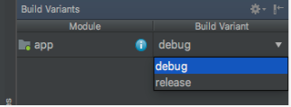
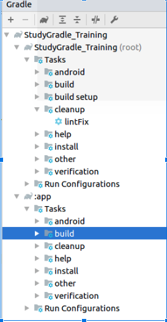
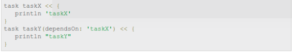
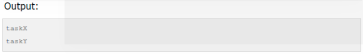
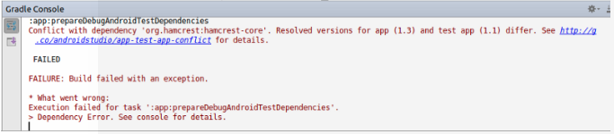
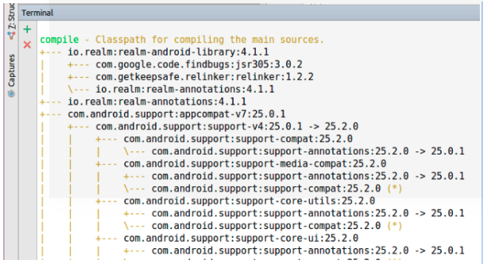

# Training-ConfigGradle

I. Định nghĩa

  Hệ thống build của Android biên dịch các file resource(layout, drawable, strings, dimens, ...) và source code gói 
  ứng dụng thành APK.
  
  Android Studio sử dụng Gradle, bộ công cụ build nâng cao, để tự động hóa và quản lý quá trình build, đồng thời 
  cho phép bạn tự xác định cấu hình build
  
  Mỗi cấu hình build có thể xác định riêng bộ code và resource của riêng nó, đồng thời sử dụng lại 
  các phần chung cho tất cả các phiên bản ứng dụng của bạn.
  
  
  Android plugin cho Gradle kết hợp với công cụ build để cung cấp tiến trình và setting có thể cấu hình được
  Gradle và Android plugin chạy độc lập với Android Studio. Điều này có nghĩa là có thể build Android app
  mà không cần Android Studio(có thể build bằng command line)
  
II. Tự cấu hình build 
 Ta có thể cấu hình nhiều mục như sau
- Build types: xác định những thuộc tính nhất định mà Gradle sử dụng khi build và đóng gói app của, 
và thường được cấu hình cho những stage khác nhau (như debug, release) trong quá trình phát triển. Khi tạo một module mới, Android Studio sẽ tự động tạo hai loại là debug và release. 
- Product Flavors:  đại diện cho nhiều phiên bản của app mà bạn có thể release tới người dùng, 
ví dụ như bản free, bản trả phí, bản cho người dùng thường, bản cho admin, ... Bạn có thể chỉnh sửa product flavors để dùng những phần code và resource khác nhau, trong khi vẫn dùng chung những phần code khác.
- Build variants: là sự tổng hợp của build types và produce flavors. 
Ví dụ như có thể build bản free(product flavors) ở loại debug (build types) hay bản cho admin(product flavors) ở loại release (build types)
- Manifest Entries: có thế cấu hình cho một số thuộc tính của file manifest ở trong build variants.
Những giá trị này sẽ override lại giá trị ở trong file manifest. Điều này có ích khi muốn gen nhiều file apk mà mỗi file có tên, min, max SDK riêng, …
Ngoài ra còn có config Dependencies, Signing, ProGuard, Multiple APK Support

III. Chi tiết

Build types: dùng cho quá trình phát triển app (debug, release, qa, staging ...), đơn giản như thay đổi api gọi tới, có log ra hay ko

a. Các loại

Có thể tạo cấu hình build types trong module-level của file build.gralde
Mặc định ban đầu là có 2 loại:
Debug: loại ta chạy ứng dụng trực tiếp từ IDE vào device, dùng khi đang phát triển và test ứng dụng
Release: loại build mà ta cần phải sign apk, phải tạo release.keystore. Release build nghĩa là app sẽ được upload lên Play Store. Có ProGuard

Ngoài ra ta có thể tự thêm build types mới, ví dụ như Q/A, Staging …
Một số thuộc tính hay dùng:
- applicationIdSuffix: hậu tố của applicationId,  nó được thêm vào sau cùng của applicationId ở trong thẻ defaultConfig {}
- proguardFiles: thường dùng với build type là release, xác định cấu hình ProGuard cho app. 
ProGuard sẽ giúp giảm kích thước ứng dụng, tối ưu code, không cho xem code của app (Obfuscate the code).

Có 2 file ProGuard Android cung cấp là proguard-android.txt, proguard-android-optimize.txt. Ta cũng phải cấu hình thêm trong file proguard-rules.pro.
- minifyEnable: để enable/disable ProGuard
- signingConfig: 

b. Cách triển khai 
Xem code 

2. Product flavors: dùng để tạo nhiều phiên bản tới người dùng

a. Các loại
Phải tạo một flavor dimenson khí tạo mới 1 flavor, nếu không sẽ bị báo lỗi 

Một số thuộc tính hay dùng
- Application Id: Mỗi phiên bản build variant sẽ có app id khác nhau tương ứng
- buildConfigField: gán giá trị cho biến tùy vào môi trường build, ví dụ như cần phải thay đổi api, thông tin người dùng, …
- resValue: tạo các resource (string, dimen, ...)
- minSdk, targetSdk, ...

b. Cách tạo: Xem code

-------------------------------------------------------------------------

Sau khi tạo Build Types và Product Flavors sẽ sinh ra Build Variant là kết hợp của cả hai cái

3. Task

a. Định nghĩa
- Task của gradle là để làm nhiệm vụ nào đó. Task có thể dùng để compile class, gen JavaDoc, tạo file JAR, nén file, copy file... Task không tự chạy mà tùy theo hành động nào đó từ cmd hoặc Android Studio
- Trong Android Studio, có thể xem list các task ở thanh dọc bên phải, mục Gradle

Những task có sẵn trong Gradle android được chia thành nhiều nhóm, có 4 nhóm chính cơ bản sau:

android: Các task ở đây liên quan đến dependencies, signingReport(Những thông tin lúc đăng lên store), sourceSets(các source set được sinh ra).

build: Các task liên quan đến build các variant khác nhau với các productFlavor khác nhau.

install: Các task liên quan đến cài đặt ứng dụng

verification: Các task liên quan đến check device, connect, kiến trúc (lint task).

Nhấn vào mục trên sẽ chạy các task tương ứng hoặc có thể dùng câu lệnh để chạy

b. Cách tạo task
Có nhiều cách tạo

Dùng trực tiếp
task hello  {
   println "Traning Gradlew"
}

Dùng create 
tasks.create(name: "hello") << {
   println "Traning Gradlew"
}

- Tạo Dependencies cho Task
Có thể tạo 1 task phụ thuộc vào một task khác, khi task đó chạy xong thì task hiện tại mới được chạy
Dùng câu lệnh dependsOn 

Chạy câu lệnh

Ngoài ra còn nhiều việc khác có thể làm với task như copy, nén file, ...

4. Exclude trong Android

Dùng để tránh việc phụ thuộc bắc cầu(transitive) được sinh ra trong ứng dụng. 
Điều này có nghĩa là 2 phụ thuộc cùng có 1 sự phụ thuộc vào các phiên bản khác nhau của cùng 
một thư viện. Ví dụ dưới đây cho thấy 2 phụ thuộc đều có chung phụ thuộc 
đến thư viện org.hamcrest:hamcrest-core đối với các phiên bản khác nhau:

dependencies {

    androidTestCompile 'junit:junit:4.12' //(Depends on version 1.3)
    
    androidTestCompile 'org.mockito:mockito-core:1.10.19' //(Depends on version 1.1)
    
}

Cả hai dependencies đều là của test dependencies nên gradle sẽ có thể xử lý confict tự động.
Nhưng nếu 2 cái thuộc vào 2 config khác nhau, như app và test thì sẽ có lỗi

compile 'junit:junit:4.12' //(Depends on version 1.3) --> Chuyển sang compile

androidTestCompile 'org.mockito:mockito-core:1.10.19' //(Depends on version 1.1)

==> Sẽ bị lỗi 

Lý do:
Khi chạy, cả APK chính và APK thử nghiệm đều có chung classpath.

Gradle sẽ build thất bại nếu APK chính và APK thử nghiệm sử dụng cùng một thư viện nhưng
trong các phiên bản khác nhau.

  Nếu gradle không bắt được điều đó, ứng dụng của bạn có thể hoạt động khác đi trong khi test 
  và trong quá trình chạy bình thường (bao gồm cả crash trong một số trường hợp).
  
Câu lệnh để check trong ubuntu
 ./gradlew dependencies app:dependencies --configuration implementation
 
Có thể thay implemention bằng androidTestImplementation, testImplementation

Hiện kết quả dạng

 Những chỗ có mũi tên -> là những bị conflict về phụ thuộc
